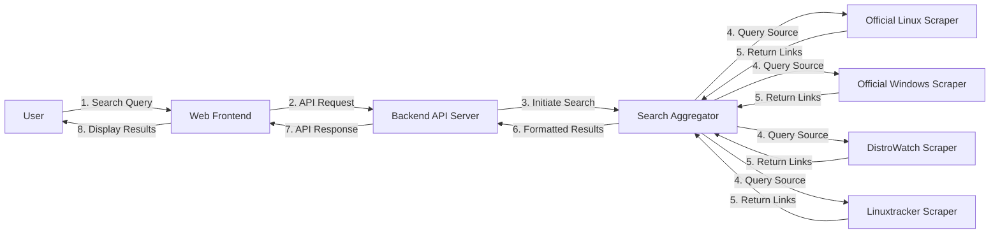

# ISO Search Engine - Design Document

## 1. Introduction

This document outlines the design for a simple web-based search engine dedicated to finding download links for Linux (specifically Ubuntu, Fedora, Debian, Linux Mint) and Windows operating system ISO images. The engine will aggregate results from official websites, DistroWatch's torrent archive, and Linuxtracker, prioritizing official sources as requested by the user.

## 2. Goals

- Provide a simple web interface for searching ISOs.
- Search across official download sites, DistroWatch torrents, and Linuxtracker.
- Prioritize official download links in the results.
- Display only the direct download links (HTTP/FTP/Torrent) initially.
- Focus on specified Linux distributions and Windows.

## 3. Architecture Overview

The system will consist of the following main components:

- **Web Frontend:** A user interface with a search input field and a results display area.
- **Backend API Server:** Handles requests from the frontend, orchestrates the search process, and returns results.
- **Search Aggregator:** Takes the user query, calls the appropriate scrapers, collects, prioritizes, and formats the results.
- **Source Scrapers:** Individual modules responsible for fetching download links from specific sources (Official Linux Sites, Official Windows Site, DistroWatch, Linuxtracker).



## 4. Component Details

### 4.1. Web Frontend
- **Technology:** HTML, CSS, JavaScript (potentially a lightweight framework like Alpine.js or vanilla JS).
- **Functionality:**
    - Display a search bar for user input (OS name/version).
    - Send the search query asynchronously to the Backend API.
    - Receive the list of links from the API.
    - Display the links, clearly indicating the source type (Official, DistroWatch, Linuxtracker) and prioritizing official links.

### 4.2. Backend API Server
- **Technology:** Python with Flask (or similar lightweight framework).
- **Functionality:**
    - Provide an API endpoint (e.g., `/search`) that accepts the search query.
    - Validate the input query.
    - Pass the query to the Search Aggregator.
    - Receive the formatted results from the Aggregator.
    - Return the results as a JSON response to the Frontend.

### 4.3. Search Aggregator
- **Technology:** Python module.
- **Functionality:**
    - Receive the search query (e.g., "Ubuntu 24.04", "Windows 11").
    - Determine which scrapers to invoke based on the query.
    - Call the relevant scraper modules concurrently (if possible) or sequentially.
    - Collect results (links and source type) from each scraper.
    - Aggregate all results.
    - Filter out duplicates.
    - Prioritize results: Official links first, then DistroWatch, then Linuxtracker.
    - Format the final list of links.
    - Return the list to the Backend API.

### 4.4. Source Scrapers
- **Technology:** Python modules using libraries like `requests` for HTTP calls and `BeautifulSoup4` for HTML parsing. Browser automation (`selenium`) might be needed for complex JavaScript-heavy sites (like Microsoft's download pages if direct links aren't easily found).
- **Modules:**
    - **Official Linux Scraper:** Logic to parse download pages of Ubuntu, Fedora, Debian, Linux Mint. This will likely involve specific parsing rules for each distribution's website structure identified during research.
    - **Official Windows Scraper:** Logic to interact with Microsoft's download pages (Windows 10, Windows 11). This might require simulating user selections or using specific known download URLs/APIs if available.
    - **DistroWatch Scraper:** Parse the HTML of the DistroWatch torrent archive page to find matching torrent links.
    - **Linuxtracker Scraper:** Parse the HTML of the Linuxtracker torrents page to find matching torrent links.
- **Error Handling:** Each scraper should handle potential errors gracefully (e.g., network issues, page structure changes, no results found).

## 5. Data Flow

1.  User enters OS name (e.g., "Fedora 42") into the Frontend search bar and submits.
2.  Frontend sends a GET request to the Backend API: `/search?q=Fedora+42`.
3.  Backend API receives the request and calls the Search Aggregator with the query "Fedora 42".
4.  Aggregator identifies "Fedora" and calls:
    - Official Linux Scraper (targeting Fedora pages).
    - DistroWatch Scraper.
    - Linuxtracker Scraper.
5.  Scrapers fetch and parse their respective pages, returning lists of links like:
    - Official: `[{"link": "https://download.fedoraproject.org/.../Fedora-Workstation-Live-x86_64-42.iso", "source": "Official"}]`
    - DistroWatch: `[{"link": "https://distrowatch.com/torrents/Fedora-Workstation-Live-x86_64-42.torrent", "source": "DistroWatch"}]`
    - Linuxtracker: `[{"link": "magnet:?xt=urn:btih:...", "source": "Linuxtracker"}]`
6.  Aggregator combines lists, prioritizes, and formats them:
    ```json
    [
      {"link": "https://download.fedoraproject.org/.../Fedora-Workstation-Live-x86_64-42.iso", "source": "Official"},
      {"link": "https://distrowatch.com/torrents/Fedora-Workstation-Live-x86_64-42.torrent", "source": "DistroWatch"},
      {"link": "magnet:?xt=urn:btih:...", "source": "Linuxtracker"}
    ]
    ```
7.  Backend API receives the formatted list and returns it as JSON to the Frontend.
8.  Frontend parses the JSON and displays the links to the user, grouped or ordered by source.

## 6. Technology Stack (Proposed)

- **Backend:** Python 3.11, Flask
- **Scraping Libraries:** `requests`, `beautifulsoup4`, potentially `selenium` (if needed)
- **Frontend:** HTML5, CSS3, Vanilla JavaScript or Alpine.js
- **Deployment:** Simple deployment using Flask's built-in server for testing, potentially `gunicorn` + `nginx` for more robust deployment, or using the `deploy_apply_deployment` tool if suitable.

## 7. Limitations & Future Improvements

- **Initial Scope:** Limited to specific Linux distros and Windows, simple link results.
- **Scraper Fragility:** Scrapers depend on website structures and may break if sites change.
- **No Caching:** Initial version will perform live scrapes for every search, which might be slow.
- **Limited Filtering:** No filtering by architecture, version (beyond what's in the query), etc.

- **Future Ideas:**
    - Add more Linux distributions.
    - Include checksums (MD5/SHA256) alongside links.
    - Implement caching for faster results.
    - Add filtering options (architecture, version, release date).
    - Improve scraper robustness (e.g., using APIs if available, better error handling).
    - User accounts/saved searches (if needed).

